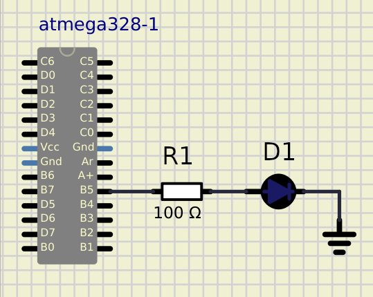

# Lab 1: Ondřej Dudášek

Link to my `Digital-electronics-2` GitHub repository:

   [https://github.com/ondrejdudasek/digital-electronics-2](https://github.com/ondrejdudasek/digital-electronics-2)


### Blink example

1. What is the meaning of the following binary operators in C?
   * `|` - binary OR
   * `&` - binary AND
   * `^` - binary XOR
   * `~` - binary NOT
   * `<< n` - shift up ( * 2^n)
   * `>> n` - shift down ( / 2^n )

2. Complete truth table with operators: `|`, `&`, `^`, `~`

| **b**  | **a**  |  **b or a**  | **b and a**  | **b xor a**  | **not b** |
|  :-:   |  :-:   |     :-:      |     :-:      |     :-:      |   :-:     |
|   0    |   0    |      0       |      0       |      1       |     1     |
|   0    |   1    |      1       |      0       |      0       |     1     |
|   1    |   0    |      1       |      0       |      0       |     0     |
|   1    |   1    |      1       |      1       |      1       |     0     |


### Morse code

1. Listing of C code with syntax highlighting which repeats one "dot" and one "comma" on a LED:

```c

#define SHORT_DELAY 200
#define LONG_DELAY 500
#define LED_GREEN 5

int main(void)
{
    // Set pin as output in Data Direction Register
    // DDRB = DDRB or 0010 0000
    DDRB = DDRB | (1<<LED_GREEN);

    // Set pin LOW in Data Register (LED off)
    // PORTB = PORTB and 1101 1111
    PORTB = PORTB & ~(1<<LED_GREEN);

    // Infinite loop
    while (1)
    {
        // LED on, short
        PORTB = PORTB | (1<< LED_GREEN);
        _delay_ms(SHORT_DELAY);

        // LED off, short
        PORTB = PORTB & ~(1<<LED_GREEN);
        _delay_ms(SHORT_DELAY);

        // LED on, long
        PORTB = PORTB | (1<< LED_GREEN);
        _delay_ms(LONG_DELAY);

        // LED off, short
        PORTB = PORTB & ~(1<<LED_GREEN);
        _delay_ms(SHORT_DELAY);

    }

    return 0;
}
```


2. Scheme of Morse code application, i.e. connection of AVR device, LED, resistor, and supply voltage. The image can be drawn on a computer or by hand. Always name all components and their values!

   
