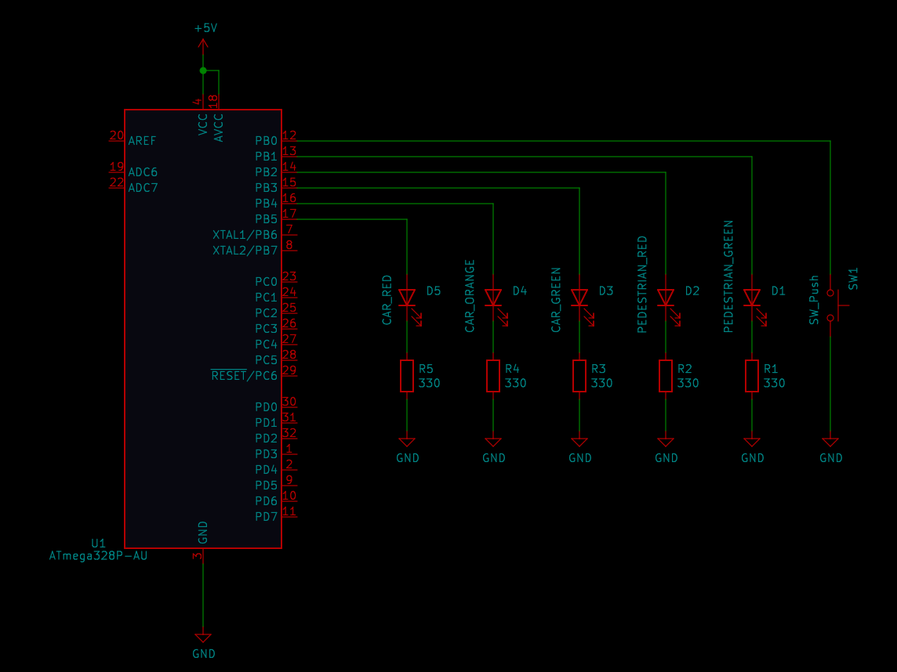

# Lab 3: Ondrej Dudasek

Link to your `Digital-electronics-2` GitHub repository:

   [https://github.com/ondrejdudasek/digital-electronics-2](https://github.com/ondrejdudasek/digital-electronics-2)


### Data types in C

1. Complete table.

| Data type | Number of bits |      Range     | Description |
|    :-:    |       :-:      |       :-:      |     :-:     |
|  uint8_t  |        8       |      0 ~ 255   | unsigned 8b integer |
|   int8_t  |        8       |   -127 ~ 255   | signed 8b integer |
| uint16_t  |        16      |      0 ~ 65535 | unsigned 16b integer |
|  int16_t  |        16      | -32767 ~ 32768 | signed 16b integer |
|   float   |        32      | -3.4e+38, ..., 3.4e+38 | Single-precision floating-point |
|    void   |        0       |        ~       |  empty variable, used mostly for defining functions without return values or pointers |


### GPIO library

1. In your words, describe the difference between the declaration and the definition of the function in C.
   * Function declaration specifies to compiler what to expect and require for using declared functions - return and argument types
   * Function definition contains algorithm itself, describes what function does. 

2. Part of the C code listing with syntax highlighting, which toggles LEDs only if push button is pressed. Otherwise, the value of the LEDs does not change. Use function from your GPIO library. Let the push button is connected to port D:

```c

int main(void)
{
    // BUTTON is pin number
    GPIO_config_input_pullup(&DDRD, BUTTON);
    // Green LED at port B
    GPIO_config_output(&DDRB, LED_GREEN);

    // Infinite loop
    while (1)
    {
        // Pause several milliseconds
        _delay_ms(BLINK_DELAY);

        if(! GPIO_read(&PIND, BUTTON)) // button is inverted
        {
           GPIO_toggle(&PORTB, LED_GREEN);
        }

    }
    return 0;
}
```


### Traffic light

1. Scheme of traffic light application with one red/yellow/green light for cars and one red/green light for pedestrians. Connect AVR device, LEDs, resistors, one push button (for pedestrians), and supply voltage. The image can be drawn on a computer or by hand. Always name all components and their values!


